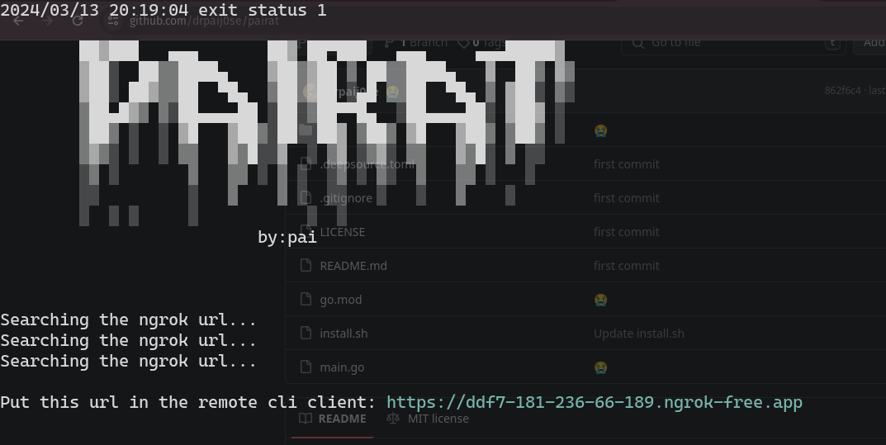

<h1>⚠️⚠️Disclaimer just use this with good intentions⚠️⚠️</h1>

<h1>Server</h1>



<h1>Prerequisites</h1>

- go 1.16+
- ngrok 2.3+
- deno 1.16+

<h1>Installation</h1>

- download the binary files from: https://github.com/drpaij0se/pairat/releases

- or download it from curl:

```bash
curl https://raw.githubusercontent.com/drpaij0se/pairat/main/install.sh | bash
```

<h1>Build</h1>

Clone the repo

Download the dependencies ```go get .```

build the program  ```go build -o pairat main.go```

<h1>todo</h1>

- [x] terminal client
- [ ] use websockets
- [ ] improve the web client
- [ ] use it remote without ngrok
- [x] working in windows correctly
